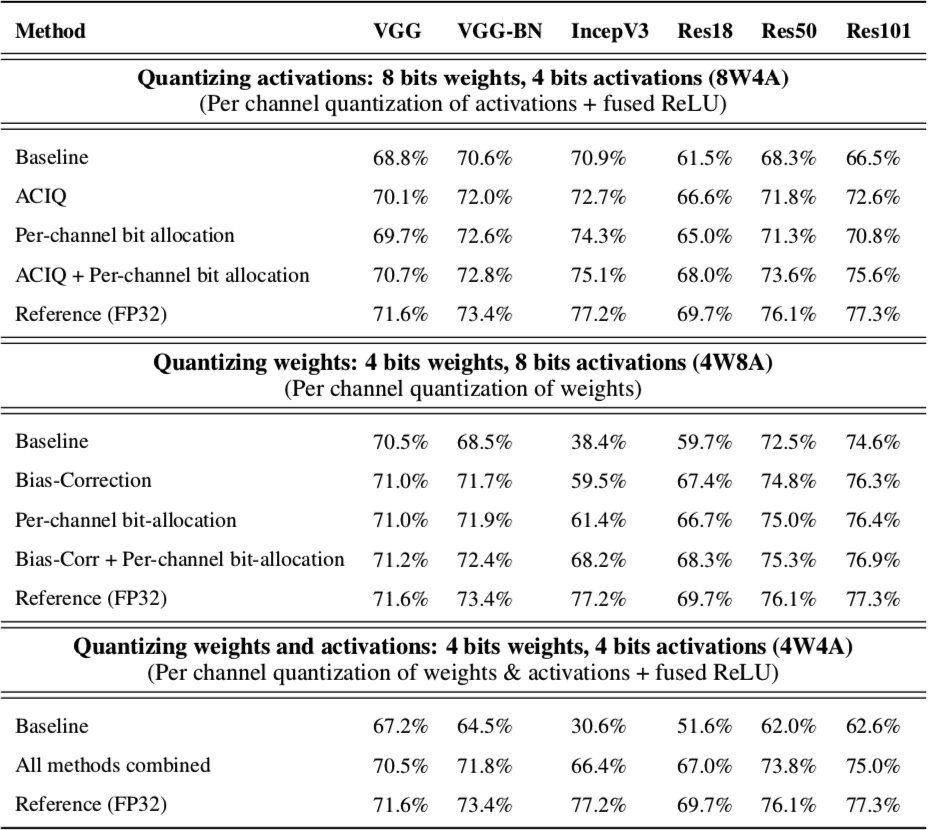

# PTQ
https://arxiv.org/pdf/1810.05723v3.pdf<br>
## 介绍

神经网络的量化造成的精度损失可以通过训练来补偿，但需要完整的数据集信息(大都涉及隐私等)，而且训练很耗时，故此一些统称为训练后量化的方法被提出，这些方法只需要量化权重和激活值，不需要重新训练。但是，低于8bit的量化会导致显著的精度下降，因此作者研究了CNN训练后的4bit量化。<br>
作者提出了三种训练后量化的方法：ACIQ、Per-channel bit allocation、Bias-correction。

## ACIQ: Analytical Clipping for Integer Quantization
通过最小化均方误差逼近最佳剪切值。论文中提出，经过研究发现对权重进行clip并无优势，因此该方法仅用于激活值的量化。<br>
假设X是高精度的随机变量，f(x)是其概率密度函数，E ( x ) = 0 (不失一般性，因为可以随时添加或减去该均值)，总位宽为M，要将值量化为 2^M 个离散值。
首先，定义一个剪裁函数 clip(x , α) , x∈R：<br>
<br>
范围为 [−α , α]。将其等分为 2^M 个量化区域，相邻的量化步长为：<br>
<br>
假设每个量化值都位于量化区域中点，则可得到X与量化后的值Q(X)的均方误差：<br>
<br>
其中，第一项和第三项是剪裁函数 clip 预期的均方误差(对于关于0对称的分布来说二者相等)，称为剪裁噪声；第二项则是将 [−α , α] 量化为 2^M 个量化区域的均方误差，称为量化噪声。<br>
作者通过构造分段函数来近似密度函数 f(x)，并且证明了量化噪声和剪裁噪声满足如下关系式(剪裁噪声是在 Laplace(0，b) 的条件下)：<br>
<br>
<br>
所以有：<br>
<br>
为找到最优的 α，令其导数为零：<br>
<br>
M = 2，3，4 时，可求得 α∗ = 2.83b， 3.89b， 5.03b；实践中，可以估算 b=E(|X-E(X)|)。<br>

求解的源代码：[mse_analysis.py](mse_analysis.py)<br>
<br/>

## Per-channel bit allocation
该方法可用于量化权重和激活值。不限制所有通道都用4位表示，而是允许一些通道具有更高的位宽，而限制其他通道具有更低的位宽。唯一的要求是，写入或从内存中读取的总比特数保持不变(即保持每个通道的平均位宽为4)，使得总体的量化噪声的均方误差最小。<br>
给定n个通道，假设通道i的取值范围为 [−α , α] ，根据公式(5)的量化噪声，引入拉格朗日乘子 λ ：<br>
<br>
令对 Mi 和 λ 的导数分别为0：<br>
<br>
<br>
然后作者证明了下列规则：<br>
<br>
两边取对数：<br>
<br>
[bit_allocation_synthetic.py](bit_allocation_synthetic.py)<br/>
<br/>

## Bias correction
该方法用于量化权重。主要思想为通过一种简单的方法补偿权重量化前后的均值和方差的偏差。<br>
作者观察到权重量化后其均值和方差存在固有偏差，即<br>
<br>
通道c的校正常数为：<br>
<br>
然后就可以用于更新权重：<br>
<br>
[bias_correction.ipynb](bias_correction.ipynb)<br/>
<br/>


## Quantization
本代码中还使用了 [GEMMLOWP](https://github.com/google/gemmlowp/blob/master/doc/quantization.md) 量化方案并用 pytorch 实现。作者通过使用 ACIQ 减小通道的范围并为每个通道分配 bits，优化了这个量化方案。
[int_quantizer.py](pytorch_quantizer/quantization/qtypes/int_quantizer.py)
<br/><br/>

## 硬件要求
NVIDIA GPU / cuda support

## 数据
- 运行本代码需要用到 [ILSVRC2012](http://www.image-net.org/) 数据集。
- 可以通过 --data "PATH_TO_ILSVRC" 来设置数据集路径，或将数据集复制到 ~/datasets/ILSVRC2012.

## 代码运行
- 创建 Python3 虚拟环境
```
virtualenv --system-site-packages -p python3 venv3
. ./venv3/bin/activate
```
- 安装
```
pip install torch torchvision bokeh pandas sklearn mlflow tqdm
```
- build kernels
To improve performance GEMMLOWP quantization was implemented in cuda and requires to compile kernels.
```
cd kernels
./build_all.sh
cd ../
```
- 运行
>*Post-training quantization of Res50.*
- Experiment W4A4 naive:
```
python inference/inference_sim.py -a resnet50 -b 512 -pcq_w -pcq_a -sh --qtype int4 -qw int4
```
>* Prec@1 62.154 Prec@5 84.252
- Experiment W4A4 + ACIQ + Bit Alloc(A) + Bit Alloc(W) + Bias correction:
```
python inference/inference_sim.py -a resnet50 -b 512 -pcq_w -pcq_a -sh --qtype int4 -qw int4 -c laplace -baa -baw -bcw
```
>* Prec@1 73.330 Prec@5 91.334
<br/>

## 实验结果



## Additional knowladge
